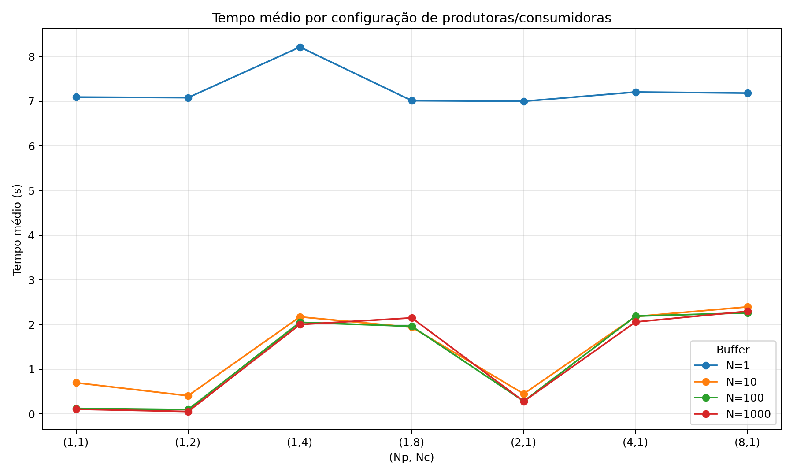
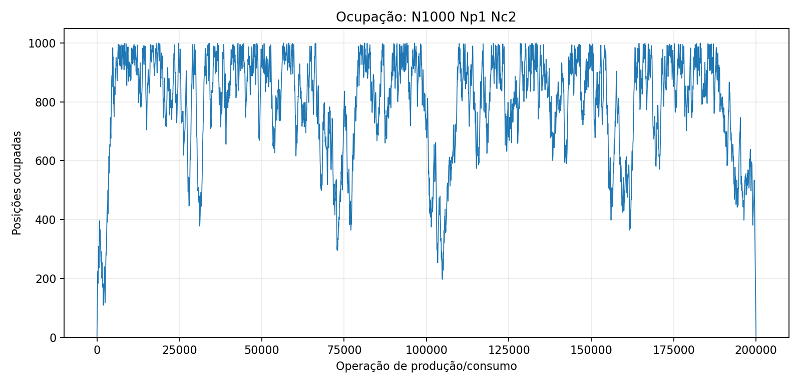

# Trabalho Prático 1 — Sistemas Distribuídos

**Integrante:** Giovanna Laura e Thainá Martins
**Matrícula:** 20213001559 e 20223002792 
**Professora:** Michelle Hanne  
**Código-fonte:** https://github.com/giovannaxsv/TP1_SD

## 1. Introdução

Este trabalho apresenta a implementação e a avaliação de mecanismos de comunicação e sincronização disponíveis em sistemas POSIX. Foram desenvolvidos, em linguagem C, três programas: comunicação assíncrona entre processos por sinais, comunicação entre processos por pipe anônimo e uma solução multithread para o problema produtor-consumidor usando memória compartilhada e semáforos.

Os experimentos foram executados no Ubuntu 26.04.1 LTS por meio do WSL2, com kernel Linux 6.18.33.2-microsoft-standard-WSL2. A máquina possui processador Intel Core i5-10210U de 1,60 GHz, quatro núcleos físicos e oito processadores lógicos. O ambiente WSL2 dispunha de aproximadamente 9,6 GiB de memória RAM e 3 GiB de swap. Os programas foram compilados com GCC usando o padrão C11, otimização `-O2` e as opções de verificação `-Wall`, `-Wextra` e `-Wpedantic`.

## 2. Comunicação por sinais

Foram implementados os programas emissor (`sender`) e receptor (`receiver`). O emissor recebe pela linha de comando o PID do processo destinatário e um dos sinais aceitos (`SIGUSR1`, `SIGUSR2` ou `SIGTERM`). Antes do envio, os argumentos são validados e a existência ou permissão de acesso ao processo é verificada com `kill(pid, 0)`. Em seguida, o sinal é enviado pela função `kill`.

O receptor registra tratadores com `sigaction`. Os sinais `SIGUSR1` e `SIGUSR2` representam mensagens distintas, enquanto `SIGTERM` solicita o encerramento do processo. Os tratadores modificam somente variáveis do tipo `volatile sig_atomic_t`; as mensagens são impressas posteriormente pelo fluxo principal, evitando o uso de funções de entrada e saída que não são seguras em contexto assíncrono.

Foram comparadas duas estratégias de espera. Na espera ativa (`busy`), o processo consulta continuamente as variáveis de controle e permanece ocupando o processador. Na espera bloqueante (`blocking`), `sigsuspend` realiza atomicamente a substituição da máscara e a suspensão do processo até a chegada de um sinal, evitando a condição de corrida que poderia existir entre testar uma condição e chamar `pause`.

Nos testes, os três sinais foram enviados corretamente pelo emissor. A espera ativa apresentou aproximadamente **99,9% de utilização de CPU**, enquanto a espera bloqueante apresentou aproximadamente **0,0%**. Portanto, a estratégia bloqueante é mais eficiente quando o processo não possui trabalho útil enquanto aguarda eventos.

## 3. Produtor-consumidor com pipe

O segundo programa implementa comunicação unidirecional entre dois processos. O pipe é criado antes de `fork`, permitindo que pai e filho herdem os descritores. O processo pai funciona como produtor, fecha a extremidade de leitura e gera uma sequência crescente definida por `Ni = Ni-1 + delta`, com `N0 = 1` e incremento pseudoaleatório entre 1 e 100. O processo filho fecha a extremidade de escrita, recebe os valores, verifica se são primos e apresenta o resultado.

Cada número é convertido em uma mensagem de exatamente 20 bytes. Funções auxiliares repetem as operações de leitura e escrita quando há interrupções ou transferências parciais, garantindo a transmissão integral de cada mensagem. Após produzir a quantidade solicitada, o pai envia o valor zero como marcador de término, fecha o pipe e aguarda o filho com `waitpid`. O funcionamento foi validado com uma execução de 10 valores, na qual o consumidor recebeu toda a sequência e terminou corretamente ao receber zero.

## 4. Produtor-consumidor com threads e semáforos

A terceira implementação utiliza um buffer circular compartilhado por `Np` threads produtoras e `Nc` threads consumidoras. Os índices de inserção e retirada são independentes. Três semáforos POSIX coordenam o acesso:

| Semáforo | Valor inicial | Função |
|---|---:|---|
| `empty_slots` | `N` | Conta posições livres e bloqueia produtoras quando o buffer está cheio. |
| `full_slots` | `0` | Conta posições ocupadas e bloqueia consumidoras quando o buffer está vazio. |
| `mutex` | `1` | Protege buffer, índices, ocupação e registro dos eventos. |

Um contador atômico distribui exatamente `M = 100000` tarefas entre as produtoras. A primalidade é testada fora da região crítica, reduzindo o tempo de posse do `mutex`. Depois do término das produtoras, a thread principal insere um zero para cada consumidora. Como o buffer é FIFO, os dados anteriores são retirados antes dos marcadores e nenhuma consumidora permanece bloqueada. A ocupação é registrada após cada produção e consumo normal, gerando `2M` observações por cenário.

## 5. Metodologia experimental e resultados

Foram avaliadas as capacidades `N = {1, 10, 100, 1000}` e as configurações `(Np,Nc) = {(1,1), (1,2), (1,4), (1,8), (2,1), (4,1), (8,1)}`. Cada uma das 28 combinações foi executada 10 vezes com `M = 100000`. A Tabela 1 apresenta, para cada capacidade, a configuração que obteve o menor tempo médio. Todos os valores e desvios-padrão estão disponíveis em `resultados/medias.csv`.

| N | Melhor `(Np,Nc)` | Tempo médio (s) | Desvio-padrão (s) |
|---:|---:|---:|---:|
| 1 | (2,1) | 7,0015 | 0,6585 |
| 10 | (1,2) | 0,4076 | 0,0221 |
| 100 | (1,2) | 0,0971 | 0,0190 |
| 1000 | (1,2) | 0,0537 | 0,0125 |

**Figura 1 — Tempo médio por configuração de produtoras e consumidoras.**

Os resultados mostram que o aumento da capacidade do buffer reduziu fortemente o custo de sincronização nas configurações com poucas threads. Com `N = 1`, todas as operações precisam alternar entre produção e consumo, mantendo os tempos próximos de 7 segundos. Com `N = 10`, a melhor média caiu para aproximadamente 0,41 segundo; com `N = 100`, para 0,097 segundo; e com `N = 1000`, para 0,054 segundo.

A configuração `(1,2)` apresentou o melhor resultado para `N = 10`, `100` e `1000`. Nesse caso, duas consumidoras puderam realizar os testes de primalidade paralelamente, enquanto uma produtora foi suficiente para manter o fluxo de dados. Entretanto, quatro ou oito threads não trouxeram ganho: para buffers maiores, essas configurações ficaram próximas ou acima de 2 segundos. Nesse ambiente e nessa carga, a sobrecarga de escalonamento, contenção nos semáforos e trocas de contexto superou o benefício do paralelismo adicional. Da mesma forma, quando existe somente uma consumidora, acrescentar produtoras não paraleliza a verificação de primalidade, que continua concentrada em uma única thread.

Foram produzidos 28 gráficos de ocupação, um para cada cenário. Nos casos com `N = 1`, a ocupação alterna obrigatoriamente entre zero e um. Em buffers maiores aparecem rajadas de enchimento e esvaziamento: mais produtoras tendem a manter a ocupação próxima da capacidade, enquanto mais consumidoras geralmente preservam mais posições livres. A Figura 2 mostra a ocupação da configuração de melhor desempenho global.

**Figura 2 — Ocupação do buffer para `N = 1000`, `Np = 1` e `Nc = 2`.**

Nessa execução, o buffer chegou próximo da capacidade em diferentes momentos, mas apresentou variações consideráveis ao longo do processamento. Isso evidencia que as velocidades relativas de produção e consumo não são constantes e também dependem do escalonamento das threads. Os demais gráficos estão disponíveis no diretório `graficos/` do repositório.

## 6. Conclusão

As implementações demonstraram três formas distintas de interação concorrente. Os sinais permitem notificação assíncrona entre processos; o pipe oferece um fluxo unidirecional de mensagens; e os semáforos coordenam threads que compartilham memória, impedindo acessos inválidos ao buffer cheio ou vazio e protegendo o estado comum contra condições de corrida.

Os experimentos também mostraram que aumentar o número de threads não garante menor tempo de execução. O tamanho do buffer e a divisão do trabalho entre produtoras e consumidoras afetam diretamente o desempenho. Nesta máquina, a melhor combinação foi `N = 1000`, uma produtora e duas consumidoras. Os scripts fornecidos permitem repetir todas as medições, recalcular as médias e regenerar os gráficos em outros ambientes.
